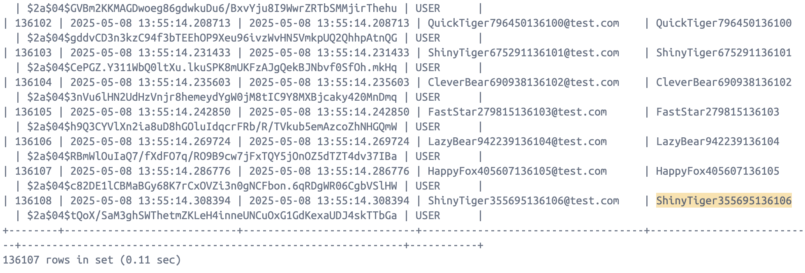
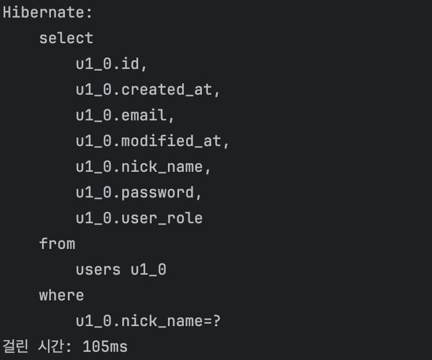
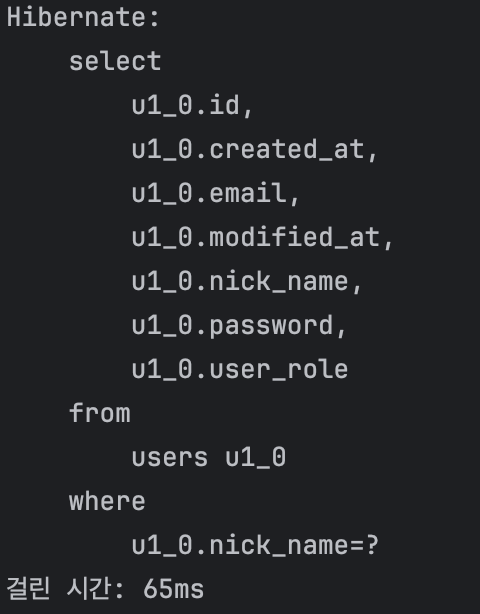

# SPRING PLUS

## lv1-3 : 코드 개선 퀴즈 -  JPA의 이해
QueryDSL을 사용해 조건 만족

## lv3-12 : AWS사용
1. [ping api](http://43.203.74.38:8080/auth/ping)
2. ec2 
3. rds 
## lv3-13 : 대용량 데이터 처리
1. user 데이터 100만개 생성 
2. 기본조회 
3. nickname컬럼에 인덱스 적용
- [데이터베이스 인덱스 구조](https://velog.io/@mxcoogi/%EB%8D%B0%EC%9D%B4%ED%84%B0%EB%B2%A0%EC%9D%B4%EC%8A%A4-%EC%9D%B8%EB%8D%B1%EC%8A%A4-%EA%B5%AC%EC%A1%B0)
